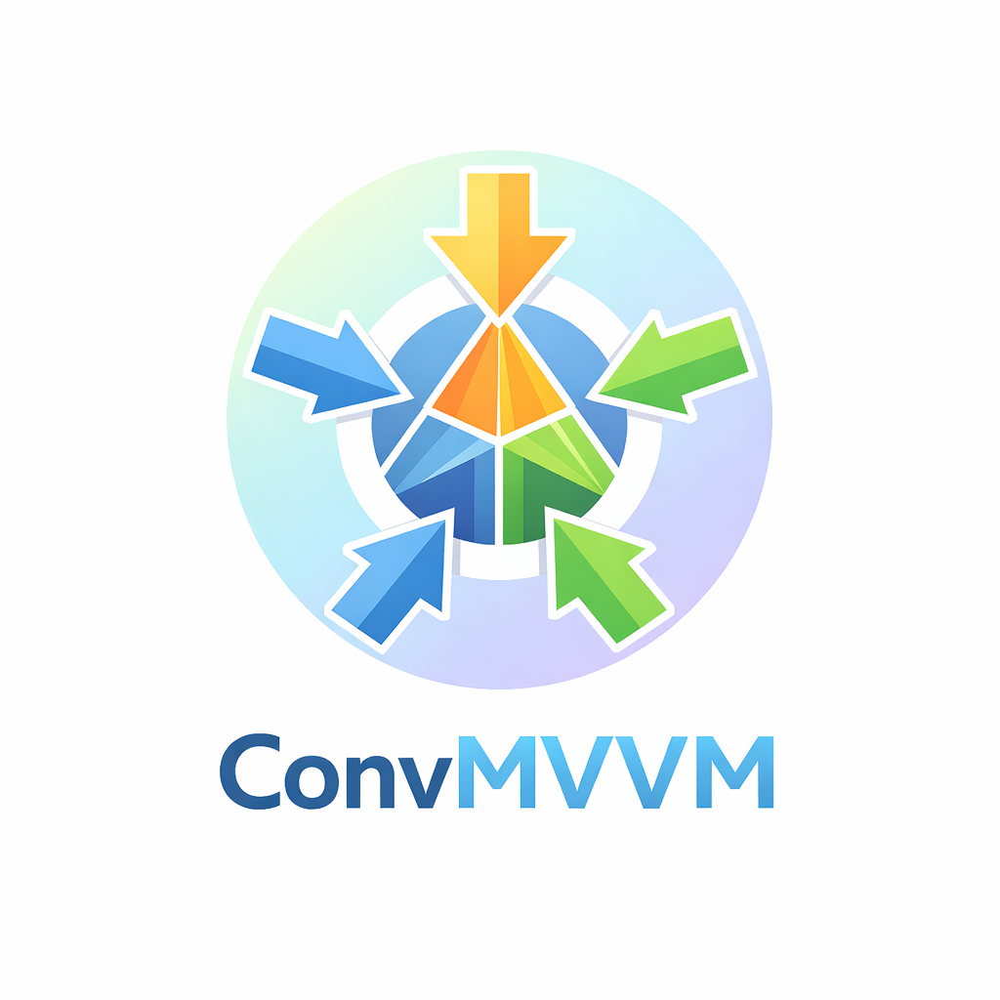

# ConvMVVM3

<p align="center">
   
</p>

**ConvMVVM3 (Convergence MVVM3)** is a modern, cross-platform MVVM framework that combines the best features from Prism and Community Toolkit while adding unique innovations.

## ✨ Key Differentiators from Prism & Community Toolkit

### 🚀 **UIDispatcher** (UNIQUE - Cross-Platform)
Microsoft-compatible UI thread dispatcher for multiple platforms:
```csharp
// Setup - Available for WPF, MAUI, Avalonia, WinUI
services.AddWPFUIDispatcher();    // WPF
services.AddMAUIUIDispatcher();    // MAUI (coming soon)
services.AddAvaloniaUIDispatcher(); // Avalonia (coming soon)

// Usage - Cross-platform compatible
await dispatcher.InvokeAsync(() => Title = "Updated");
```

### 🔌 **Smart Dependency Injection** (UNIQUE - Built-in)
Lightweight service container with addon system - **No external DI required**:
```csharp
// Built-in container - Zero external dependencies
services.AddSingleton<IMyService, MyService>();
services.AddAddon<MyAddon>();
```

### 📡 **WeakReference Messenger** (Memory-Safe, Cross-Platform)
Thread-safe messaging with automatic cleanup:
```csharp
// Automatic weak references - Platform-agnostic
WeakReferenceMessenger.Default.Send<Message>(this, newData);
```

### 🎯 **Region System** (Prism-inspired, Cross-Platform)
Built-in region management for multiple frameworks:
```csharp
// Available for WPF, MAUI, Avalonia, WinUI
<ContentControl regions:RegionManager.RegionName="MainRegion" />
```

### ⚡ **Source Generator** (Community Toolkit-inspired)
Automatic property and command generation with enhanced features:
```csharp
[ObservableProperty] private string title;       // Generates Title property
[RelayCommand] private void Save();              // Generates SaveCommand  
[AsyncRelayCommand] private async Task Load();  // Generates LoadCommand
```

## 🏗️ Architecture Overview

### **Core MVVM Components** (Platform-Agnostic)
```
ConvMVVM3.Core/
├── ObservableObject              # Base class with INotifyPropertyChanged
├── ObservableRecipient          # Message recipient base class
├── UIDispatcher               # NEW: Cross-platform dispatcher interface
├── WeakReferenceMessenger       # Memory-safe messaging system
├── Commands/
│   ├── RelayCommand          # Synchronous command implementation
│   └── AsyncRelayCommand     # Async command with cancellation
└── DependencyInjection/       # Built-in DI container
```

### **WPF Implementation** (One of Many Platforms)
```
ConvMVVM3.WPF/           # WPF-specific implementation
├── RegionManager              # Region management (Prism-inspired)
├── WPFUIDispatcher          # WPF-specific dispatcher
├── Behaviors/               # Interactive behaviors
│   ├── Triggers/           # Event triggers
│   └── Actions/            # Action behaviors
└── WeakEventManager          # Memory-efficient event handling
```

### **Cross-Platform Strategy**
```
Platforms Status:
✅ WPF              - Full implementation (current)
🔄 MAUI              - Planned (UIDispatcher + Behaviors)
🔄 Avalonia          - Planned (UIDispatcher + Behaviors)
🔄 WinUI              - Planned (UIDispatcher + Behaviors)
🔄 UNO Platform      - Planned (UIDispatcher + Behaviors)
```

### **Source Generation** (Cross-Platform)
```
ConvMVVM3.SourceGenerator/
├── ObservableProperty generation    # Auto property implementation
├── RelayCommand generation        # Auto command creation
├── Dependency tracking          # Smart property notification
└── Compile-time validation       # Early error detection
```

## 📁 Project Structure

```
ConvMVVM3.Core/              # Platform-agnostic MVVM library
ConvMVVM3.SourceGenerator/    # Cross-platform source generator
ConvMVVM3.WPF/              # WPF-specific behaviors + regions
ConvMVVM3.Host/              # DI host implementation
ConvMVVM3.WPF.Tests/         # WPF unit tests (30 passing)
ConvMVVM3.Tests/             # Core unit tests (77 passing)
```

## 🛠️ Installation

```bash
dotnet add package ConvMVVM3
```

## 🚀 Quick Start

### Basic ViewModel with Cross-Platform Generation

```csharp
// Works on ALL supported platforms
public partial class MainViewModel : ObservableObject
{
    [ObservableProperty]
    private string title = "Hello ConvMVVM3!";
    
    [RelayCommand]
    private void ShowMessage() => MessageBox.Show(Title);
    
    [AsyncRelayCommand]
    private async Task LoadDataAsync()
    {
        Title = "Loading...";
        await Task.Delay(1000);
        Title = "Data Loaded!";
    }
}
```

### Cross-Platform UIDispatcher Integration

```csharp
// Setup varies by platform
services.AddWPFUIDispatcher();      // WPF
// services.AddMAUIUIDispatcher();    // MAUI (coming)
// services.AddAvaloniaUIDispatcher(); // Avalonia (coming)

// Usage is identical across platforms
public partial class MyViewModel : ObservableObject
{
    private readonly IUIDispatcher _dispatcher;
    
    public MyViewModel(IUIDispatcher dispatcher)
    {
        _dispatcher = dispatcher;
    }
    
    [AsyncRelayCommand]
    private async Task UpdateFromBackgroundAsync()
    {
        var data = await Task.Run(() => GetHeavyData());
        
        // Thread-safe UI update (cross-platform)
        await _dispatcher.InvokeAsync(() => Title = data);
    }
}
```

### Cross-Platform Region Management

```xml
<!-- Works on WPF, MAUI, Avalonia, WinUI -->
<Grid>
    <ContentControl regions:RegionManager.RegionName="MainRegion" />
</Grid>

<!-- Platform-agnostic navigation -->
_regionManager.RequestNavigate("MainRegion", typeof(HomeViewModel));
```

### Memory-Safe Cross-Platform Messaging

```csharp
// Sender (all platforms)
WeakReferenceMessenger.Default.Send<DataUpdatedMessage>(this, newData);

// Receiver (auto-cleanup, all platforms)
public partial class MyViewModel : ObservableObject, IRecipient<DataUpdatedMessage>
{
    public void Receive(DataUpdatedMessage message)
    {
        Title = message.Data;
    }
}
```

### WPF-Specific Behaviors

```xml
<!-- WPF-specific - MAUI/Avalonia equivalents planned -->
<Button Content="Click Me">
    <i:Interaction.Triggers>
        <i:EventTrigger EventName="Click">
            <i:InvokeCommandAction Command="{Binding SaveCommand}" />
        </i:EventTrigger>
    </i:Interaction.Triggers>
</Button>
```

## 🎯 Platform Support Matrix

| Feature | WPF | MAUI | Avalonia | WinUI | UNO |
|---------|------|------|----------|-------|-----|
| **Core MVVM** | ✅ | ✅ | ✅ | ✅ | ✅ |
| **UIDispatcher** | ✅ | 🔄 | 🔄 | 🔄 | 🔄 |
| **Source Generator** | ✅ | ✅ | ✅ | ✅ | ✅ |
| **Region System** | ✅ | 🔄 | 🔄 | 🔄 | 🔄 |
| **Built-in DI** | ✅ | ✅ | ✅ | ✅ | ✅ |
| **Weak Messenger** | ✅ | ✅ | ✅ | ✅ | ✅ |
| **WPF Behaviors** | ✅ | ❌ | ❌ | ❌ | ❌ |
| **Platform Behaviors** | ❌ | 🔄 | 🔄 | 🔄 | 🔄 |

*✅ Available | 🔄 Planned | ❌ Not applicable*

## 🎯 Comparison Matrix

| Feature | ConvMVVM3 | Community Toolkit | Prism |
|---------|-------------|-------------------|-------|
| **Cross-Platform** | ✅ WPF + planned others | ✅ Many platforms | ❌ WPF only |
| **Built-in DI** | ✅ Lightweight | ❌ External only | ❌ External only |
| **UIDispatcher** | ✅ Cross-platform | ❌ Manual only | ❌ Manual only |
| **Region System** | ✅ Cross-platform | ❌ Not included | ❌ WPF only |
| **Weak Messenger** | ✅ Auto-cleanup | ✅ Basic | ❌ Manual cleanup |
| **Source Generator** | ✅ Full feature | ✅ Advanced | ❌ Not included |
| **Memory Safety** | ✅ Designed for safety | ⚠️ Partial | ⚠️ Manual |
| **Zero Dependencies** | ✅ Self-contained | ❌ Many packages | ❌ Many packages |

## 🎯 Testing Status

### **WPF Unit Tests** ✅ (30/30 passing)
- ✅ UIDispatcher functionality
- ✅ Dependency injection integration
- ✅ Region management
- ✅ Behavior system
- ✅ Messaging system

### **Core Unit Tests** ✅ (77/77 passing)
- ✅ ObservableObject behavior
- ✅ Command implementations
- ✅ Source generator output
- ✅ Messaging system
- ✅ Dependency injection

**Total: 107/107 tests passing (100%)**

## 📄 License

MIT License - see [LICENSE](LICENSE) file

---

**ConvMVVM3**: Modern, cross-platform MVVM framework that bridges the gap between Prism's power and Community Toolkit's simplicity while adding unique cross-platform innovations.

**Future Roadmap**: MAUI, Avalonia, WinUI, and UNO Platform support coming soon!